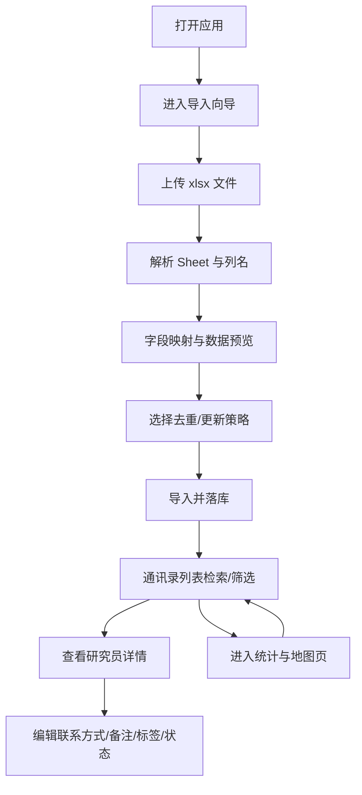

## 1. 产品概述
面向个人科研信息管理的本地通讯录应用：从 Excel（xlsx）一键导入研究人员信息，并支持快速检索、分组筛选与可视化统计。
- 解决问题：Excel 分散管理难检索、难筛选、难统计的问题
- 目标用户：需要长期积累研究人员信息、并按地区/方向/院校快速定位的人

## 2. 核心功能

### 2.1 用户角色
| 角色 | 使用方式 | 核心权限 |
|------|----------|----------|
| 本地用户 | 本地启动直接使用 | 导入、浏览、搜索、编辑、打标签、可视化 |

### 2.2 功能模块
1. **通讯录列表页**：检索、筛选、排序、分组、批量操作入口
2. **研究员详情页**：结构化信息展示、可编辑、标签与跟进信息
3. **导入向导页**：上传 xlsx、多 Sheet 分组导入、字段映射预览、去重策略
4. **统计与地图页**：按大洲/国家/分组统计，地图可视化展示分布

### 2.3 页面详情
| 页面名称 | 模块名称 | 功能描述 |
|---------|----------|----------|
| 通讯录列表页 | 顶部检索栏 | 支持姓名/学校/研究方向/备注等模糊搜索 |
| 通讯录列表页 | 筛选面板 | 按大洲、国家/地区、学校、Sheet 分组、标签、跟进状态筛选 |
| 通讯录列表页 | 结果列表 | 卡片/表格双视图切换；可按姓名/学校/更新时间排序 |
| 通讯录列表页 | 快捷操作 | 一键打开个人主页/招生网站；复制常用字段 |
| 研究员详情页 | 信息区块 | 基础信息、研究方向、链接、联系方式、备注、分组与标签 |
| 研究员详情页 | 编辑与保存 | 字段级编辑；保存后立即生效；更新时间记录 |
| 导入向导页 | 文件上传 | 上传 xlsx；显示文件概览（Sheet 数、行数、列名） |
| 导入向导页 | Sheet 分组导入 | 默认按 Sheet 自动分组；可选择是否导入某些 Sheet |
| 导入向导页 | 字段映射与预览 | 自动识别常见列；可手动调整；导入前预览前 N 行 |
| 导入向导页 | 去重与更新策略 | 可选：跳过重复/更新已有/全部导入；按（姓名+学校+主页）综合匹配 |
| 统计与地图页 | 指标卡 | 总人数、国家数、大洲数、最近新增数 |
| 统计与地图页 | 分布图表 | 柱状/饼图：按大洲/国家/分组/标签统计 |
| 统计与地图页 | 地图可视化 | 世界地图着色或气泡点；点击区域筛选列表联动 |

## 3. 核心流程
用户主流程（导入 → 检索 → 维护 → 可视化）：

## 4. 用户界面设计

### 4.1 设计风格
- 视觉方向：学术通讯录工具的“纸质档案 + 编辑部排版”风格（高对比墨色、柔和纸张底纹、细线分割）
- 主色：深墨黑、纸张米白
- 辅色：学术蓝（强调链接与筛选选中态）、铜金（用于统计高亮）
- 字体：标题使用衬线展示字体（更像期刊标题），正文使用清晰的无衬线（适合长列表）
- 布局：桌面优先；左侧筛选 + 右侧内容；地图/图表可占据整屏
- 动效：筛选切换与导入步骤使用轻量过渡；地图 hover 显示 tooltip

### 4.2 页面设计概览
| 页面名称 | 模块名称 | UI 元素 |
|---------|----------|---------|
| 通讯录列表页 | 检索与筛选 | 搜索框、筛选抽屉/侧栏、多选标签、清除筛选按钮、结果计数 |
| 通讯录列表页 | 列表展示 | 表格/卡片切换、可排序表头、行 hover、快速打开链接按钮 |
| 研究员详情页 | 信息排版 | 双栏信息区块、可编辑输入框、标签胶囊、跟进状态徽章 |
| 导入向导页 | 步骤条 | Stepper、上传区域、列映射表格、预览表格、导入结果摘要 |
| 统计与地图页 | 可视化 | 指标卡、图表、世界地图、hover 提示、点击联动列表 |

### 4.3 响应式
- 桌面优先：列表页采用侧栏筛选与主内容区布局
- 窄屏适配：筛选改为抽屉；图表与地图自动堆叠；表格切换为卡片视图
