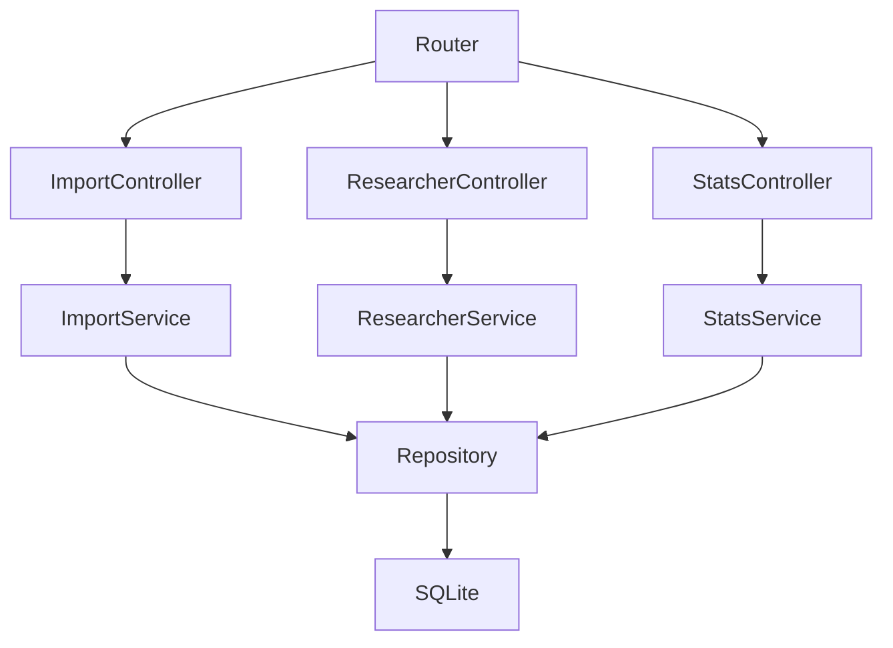
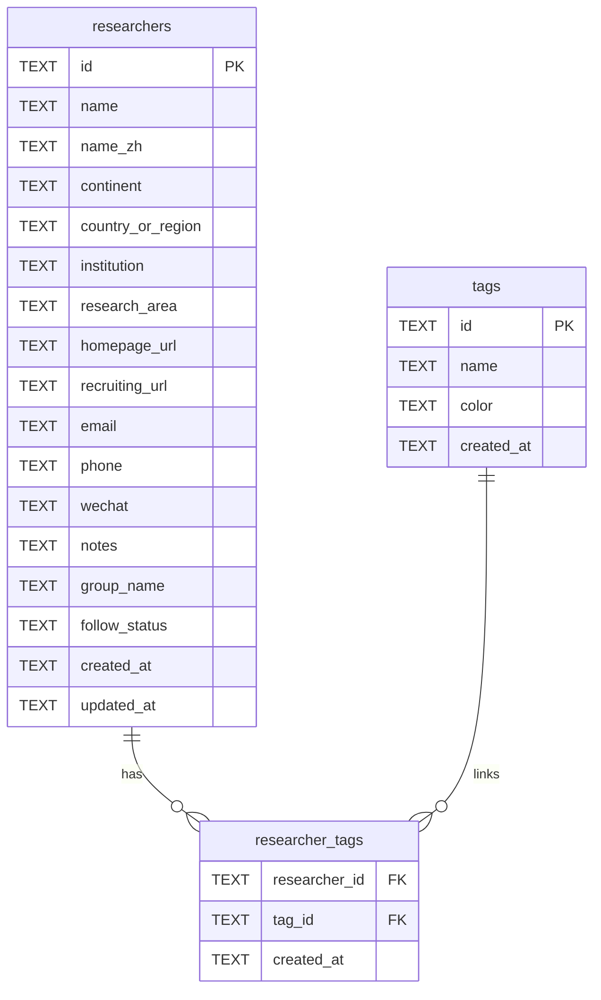

## 1. 架构设计


## 2. 技术说明
- 前端：React@18 + TypeScript + react-router-dom + tailwindcss + zustand
- 前端可视化：图表库（用于大洲/国家统计）+ 地图库（用于世界地图分布）
- 后端：Express@4（TypeScript + ESM）
- 数据库：SQLite（本地文件），提供结构化存储与全文检索友好查询
- 导入解析：xlsx（解析多 Sheet、列名与行数据）

## 3. 路由定义（前端）
| Route | 用途 |
|-------|------|
| / | 通讯录列表与筛选 |
| /researcher/:id | 研究员详情与编辑 |
| /import | xlsx 导入向导 |
| /insights | 统计与地图可视化 |

## 4. API 定义（后端）

### 4.1 TypeScript 数据类型（共享约定）
```ts
export type FollowStatus = "todo" | "contacted" | "replied" | "closed"

export type Researcher = {
  id: string
  name: string
  nameZh?: string | null
  continent?: string | null
  countryOrRegion?: string | null
  institution?: string | null
  researchArea?: string | null
  homepageUrl?: string | null
  recruitingUrl?: string | null
  email?: string | null
  phone?: string | null
  wechat?: string | null
  notes?: string | null
  groupName?: string | null
  followStatus?: FollowStatus | null
  createdAt: string
  updatedAt: string
}
```

### 4.2 端点列表
| 方法 | 路径 | 用途 |
|------|------|------|
| POST | /api/import/xlsx | 上传并解析 xlsx，返回预览与建议映射 |
| POST | /api/import/commit | 按映射与策略写入数据库，返回导入摘要 |
| GET | /api/researchers | 列表查询：支持 q、筛选、分页、排序 |
| GET | /api/researchers/:id | 获取详情 |
| PATCH | /api/researchers/:id | 更新研究员信息 |
| GET | /api/stats/summary | 总数/国家数/大洲数/最近新增 |
| GET | /api/stats/by-continent | 按大洲统计 |
| GET | /api/stats/by-country | 按国家/地区统计 |
| GET | /api/tags | 标签列表 |
| POST | /api/tags | 新建标签 |
| PUT | /api/researchers/:id/tags | 覆盖设置研究员标签 |

## 5. 服务端架构图



## 6. 数据模型

### 6.1 ER 图


### 6.2 DDL（SQLite）
```sql
PRAGMA foreign_keys = ON;

CREATE TABLE IF NOT EXISTS researchers (
  id TEXT PRIMARY KEY,
  name TEXT NOT NULL,
  name_zh TEXT,
  continent TEXT,
  country_or_region TEXT,
  institution TEXT,
  research_area TEXT,
  homepage_url TEXT,
  recruiting_url TEXT,
  email TEXT,
  phone TEXT,
  wechat TEXT,
  notes TEXT,
  group_name TEXT,
  follow_status TEXT,
  created_at TEXT NOT NULL,
  updated_at TEXT NOT NULL
);

CREATE INDEX IF NOT EXISTS idx_researchers_name ON researchers(name);
CREATE INDEX IF NOT EXISTS idx_researchers_institution ON researchers(institution);
CREATE INDEX IF NOT EXISTS idx_researchers_continent ON researchers(continent);
CREATE INDEX IF NOT EXISTS idx_researchers_country ON researchers(country_or_region);
CREATE INDEX IF NOT EXISTS idx_researchers_group ON researchers(group_name);

CREATE TABLE IF NOT EXISTS tags (
  id TEXT PRIMARY KEY,
  name TEXT NOT NULL UNIQUE,
  color TEXT,
  created_at TEXT NOT NULL
);

CREATE TABLE IF NOT EXISTS researcher_tags (
  researcher_id TEXT NOT NULL,
  tag_id TEXT NOT NULL,
  created_at TEXT NOT NULL,
  PRIMARY KEY (researcher_id, tag_id),
  FOREIGN KEY (researcher_id) REFERENCES researchers(id) ON DELETE CASCADE,
  FOREIGN KEY (tag_id) REFERENCES tags(id) ON DELETE CASCADE
);

CREATE INDEX IF NOT EXISTS idx_researcher_tags_tag ON researcher_tags(tag_id);
```
